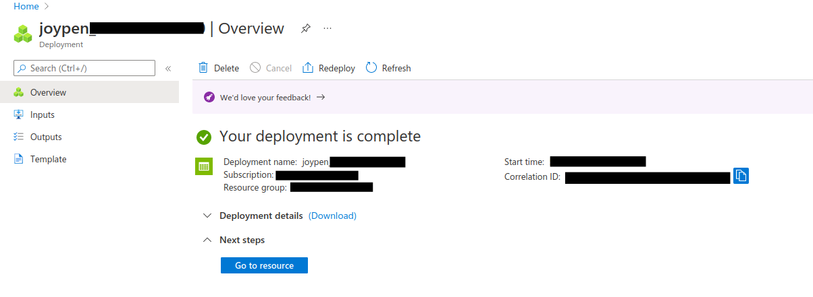
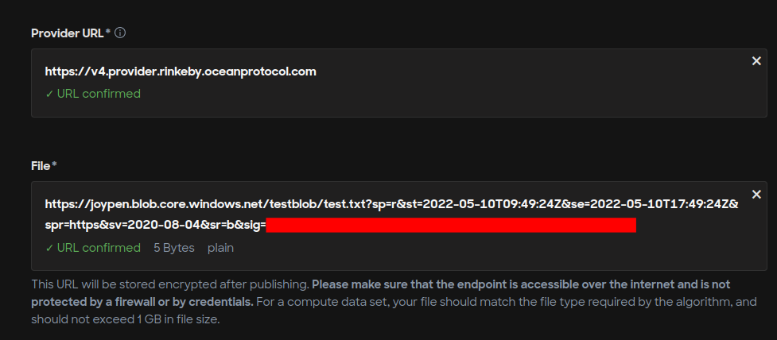
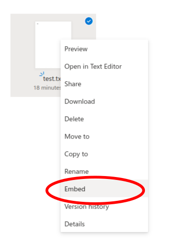
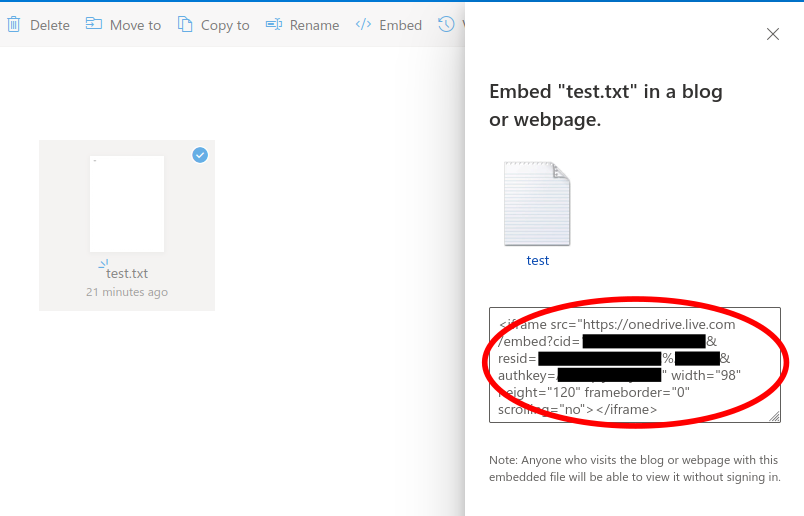
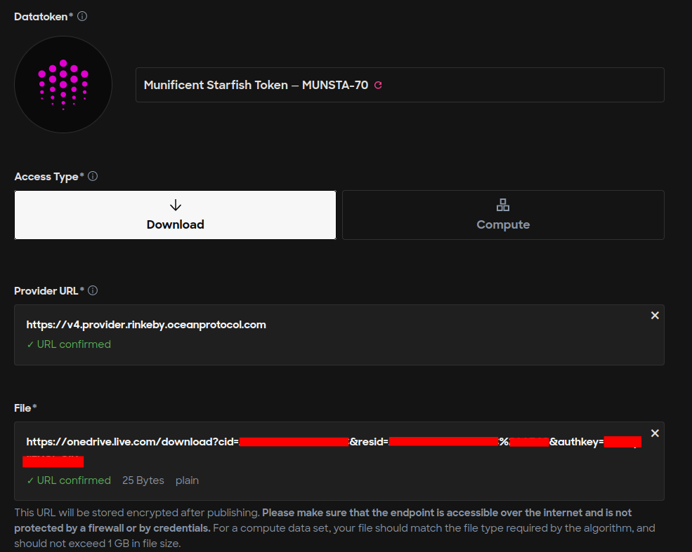

# Publishing with Hosting Services

### Overview

To publish assets on the Ocean Marketplace, publishers must provide a link(an URL) to the file. It is up to the asset publisher to decide where to host the asset. For example, a publisher can store the content on their Google Drive, AWS server, private cloud server, or other third-party hosting services. Through publishing, the URL of the asset is encrypted and stored as a part of DDO on the blockchain. Buyers don't have access directly to the URL, but they interact with the Provider, which decrypts the URL and acts as a proxy to serve the asset. The DDO only stores the location of the file, which is accessed on-demand by the Provider. Implementing a security policy that allows only the Provider to access the URL and blocks requests from other unauthorized actors is recommended. One of the possible ways to achieve this is to allow only the Provider's IP address to access the URL. But, not all hosting services provide this feature. So, the publishers must consider the security features while choosing a hosting service.

On Ocean Marketplace, a publisher must provide the link to the asset during publish step. Once the asset is published, this link cannot be changed. So, it is essential that the publisher correctly sets this field (shown in the below image).

.png>)

### Hosting services

Publishers can choose any hosting service of their choice. The below section explains how to use commonly used hosting services with Ocean Marketplace.

#### Arweave

[Arweave](https://www.arweave.org/) is a global, permanent, and decentralized data storage layer that allows you to store documents and applications forever. Arweave is different from other decentralized storage solutions in that there is only one up-front cost to upload each file.

**Step 1 - Get a new wallet and AR tokens**

Download & save a new wallet (JSON key file) and receive a small amount of AR tokens for free using the [Arweave faucet](https://faucet.arweave.net/). If you already have an Arweave browser wallet, you can skip to Step 3.

At the time of writing, the faucet provides 0.02 AR which is more than enough to upload file.

If at any point you need more AR tokens, you can fund your wallet from one of Arweave's [supported exchanges](https://arwiki.wiki/#/en/Exchanges).

**Step 2 - Load the key file into the arweave.app web wallet**

Open [arweave.app](https://arweave.app/) in a browser. Select the '+' icon in the bottom left corner of the screen. Import the JSON key file from step 1.

<figure><figcaption><p>arweave.app import key file</p></figcaption></figure>

**Step 3 - Upload file**

Select the newly imported wallet by clicking the "blockies" style icon in the top left corner of the screen. Select **Send.** Click the **Data** field and select the file you wish to upload.

<figure><figcaption><p>arweave.app upload file</p></figcaption></figure>

The fee in AR tokens will be calculated based on the size of the file and displayed near the bottom middle part of the screen. Select **Submit** to submit the transaction.

After submitting the transaction, select **Transactions** and wait until the transaction appears and eventually finalizes. This can take over 5 minutes so please be patient.&#x20;

**Step 4 - Copy the transaction ID**

Once the transaction finalizes, select it, and copy the transaction ID.

<figure><figcaption><p>arweave.app transaction ID</p></figcaption></figure>

**Step 5 - Publish the asset with the transaction ID**

TODO - Add a picture of the Ocean Market publish page with Arweave storage selected

#### Google Drive

Google Drive allows users to share files/folders with various access policies. Publishers must set the access policy such that anyone with the link can download the file when using Ocean Marketplace with Ocean Protocol's default [Provider](https://v4.provider.rinkeby.oceanprotocol.com).

**Step 1 - Get link**

Open https://drive.google.com and upload the file you want to publish on the Ocean Marketplace. Right-click on the uploaded file and click the `Share` option. Set the file access policy correctly and click the `Copy link` button.

The file URL will be of the form `https://drive.google.com/file/d/<FILE-ID>/view?usp=sharing`, where the `<FILE-ID>` is the unique alphanumeric string. Verify if the URL is correct by entering it in a browser and check if the file is downloaded.

.png>)

**Step 2 - Create a downloadable link**

If you paste the copied URL into the browser, it will load an HTML page. Directly pasting the link on the publish page will publish the HTML page instead of a downloadable file URL. So, let's make a downloadable file URL.

Note the `<FILE-ID>` from step 1 and create a URL as below.

`https://drive.google.com/uc?export=download&id=<FILE-ID>`

**Step 3 - Publish the asset using the generated link**

After creating a downloadable file URL, fill the `File*` field with the downloadable URL created in step 2.

.png>)

_Note: Google Drive allows only shared files to be downloaded, as shown in the above steps. The above method does not work with the shared folder. As a workaround, publishers can upload a zip of a folder and upload it as a file._

***

#### Azure storage

Azure provides various options to host data and multiple configuration possibilities. Publishers are required to do their research and decide what would be the right choice. The below steps provide one of the possible ways to host data using Azure storage and publish it on Ocean Marketplace.

**Prerequisite**

Create an account on [Azure](https://azure.microsoft.com/en-us/). Users might also be asked to provide payment details and billing addresses that are out of this tutorial's scope.

**Step 1 - Create a storage account**

**Go to Azure portal**

Go to the Azure portal: https://portal.azure.com/#home and select `Storage accounts` as shown below.


**Create a new storage account**


**Fill in the details**


**Storage account created**



**Step 2 - Create a blob container**


**Step 3 - Upload a file**


**Step 4 - Share the file**

**Select the file to be published and click Generate SAS**


**Configure the SAS details and click `Generate SAS token and URL`**


**Copy the generated link**


**Step 5 - Publish the asset using the generated link**

Now, copy and paste the link in the Publish page in the Ocean Marketplace.



#### OneDrive

Create an account on [Microsoft](https://www.microsoft.com/en-us/microsoft-365/onedrive/online-cloud-storage).

**Step 1 - Upload a file**

Go to [OneDrive](https://onedrive.live.com/) and upload the file to be published.


**Step 2 - Get link**

After the file is uploaded, right click on the file and click `Embed`, and copy the link.



Copy the highlighted content as shown in the below image:



The copied content has the following format:

```html
<iframe src="https://onedrive.live.com/embed?cid=<CID>&
    resid=<RES_ID>%<NUMBER>&
    authkey=<AUTH_KEY>"
    width="98" height="120" frameborder="0" scrolling="no">
</iframe>
```

**Step 3 - Generate downloadable link**

Copy the content from `src` field from the `iframe`. The link has the following format: `https://onedrive.live.com/embed?cid=<CID>&resid=<RES_ID>%<NUMBER>&authkey=<AUTH_KEY>`

Replace the `https://onedrive.live.com/embed` with `https://onedrive.live.com/download` from the above URL.

The downloadable file URL has the following format: `https://onedrive.live.com/download?cid=<CID>&resid=<RES_ID>%<NUMBER>&authkey=<AUTH_KEY>`

Enter the URL in the browser and verify if the file is downloaded correctly.

**Step 4 - Publish the asset using the generated link**

Copy and paste the link in the Publish page in the Ocean Marketplace.


