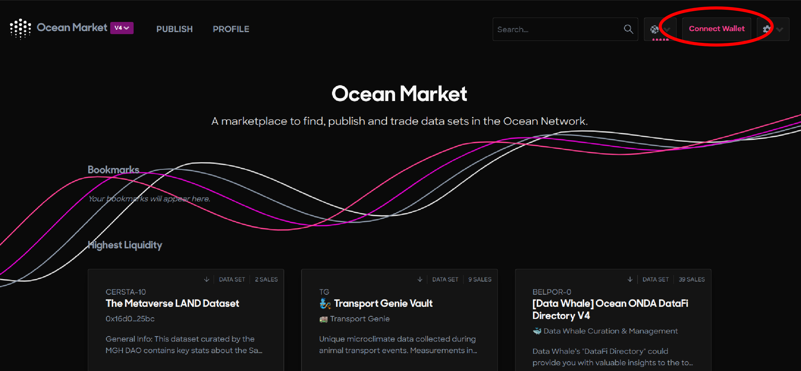
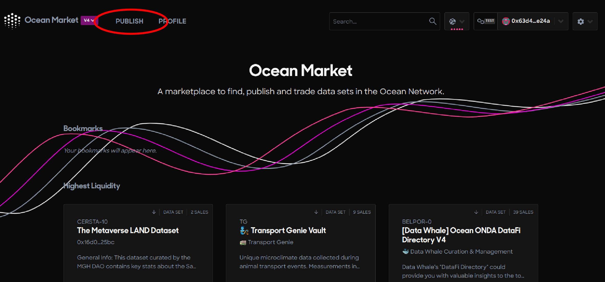
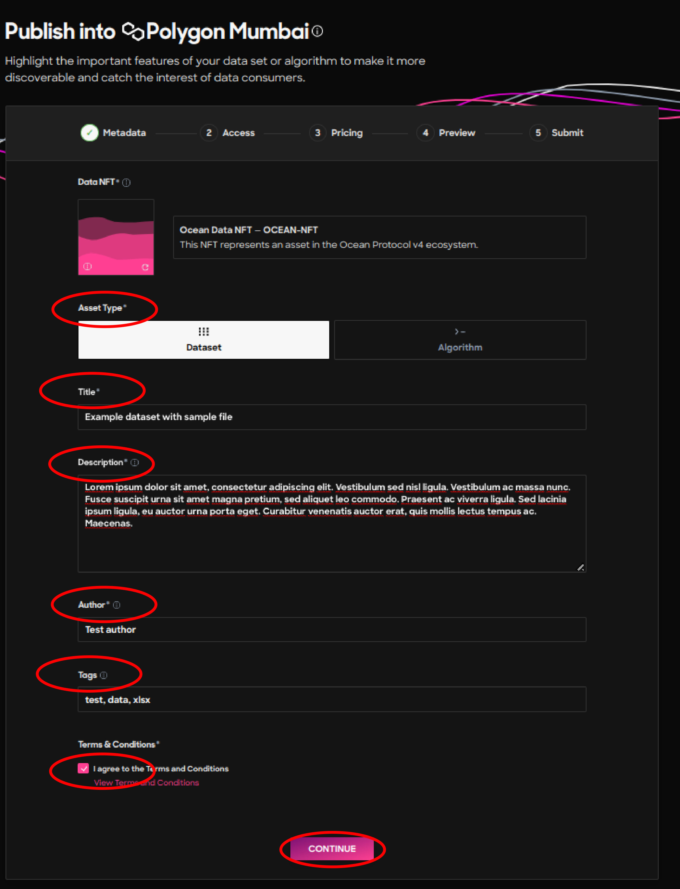
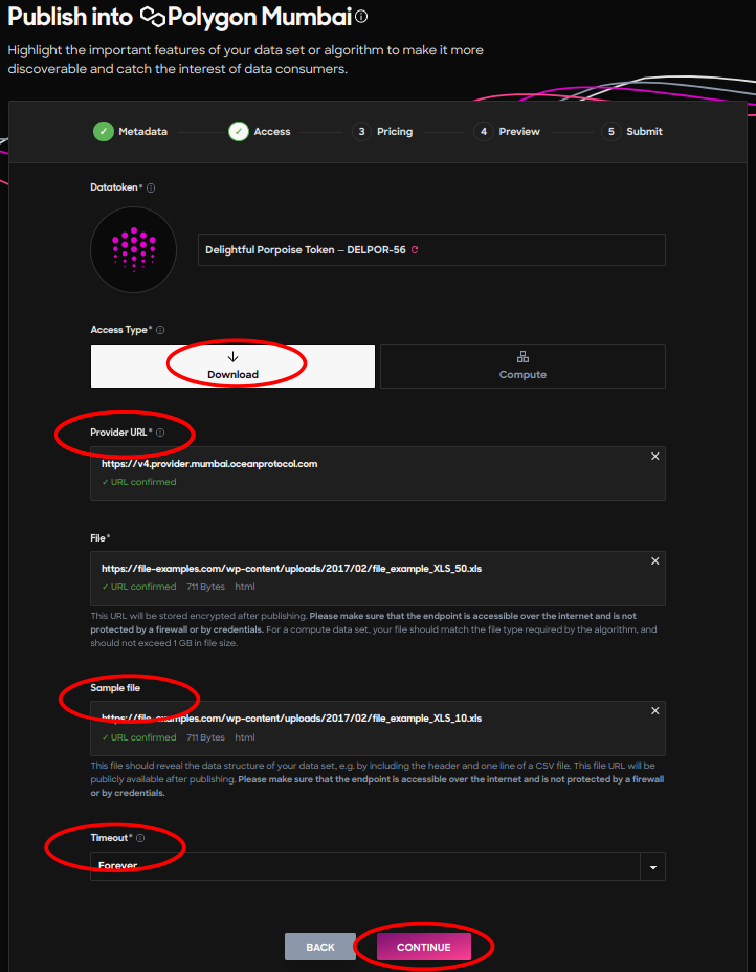
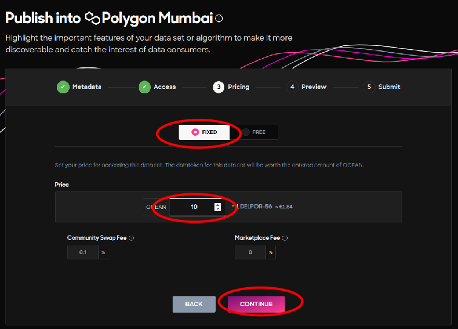
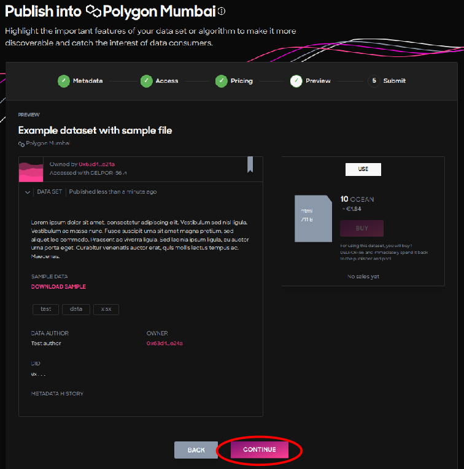
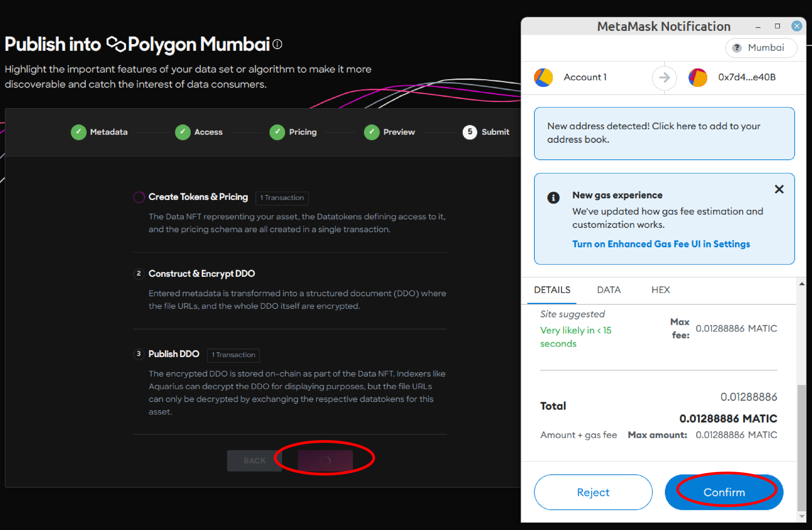

# Publish a Data Asset

### What can be published?

Ocean Market provides a convenient interface for individuals and organizations to publish their data. Datasets can be images, location information, audio, video, sales data, or combinations of all! There is no exhaustive list of what type of data can be published on the Market. Please note the Ocean Protocol team maintains a purgatory list [here](https://github.com/oceanprotocol/list-purgatory) to block addresses and remove assets for any violations.

### Tutorial

#### Connect wallet and navigate to the publish page

1. Go to [Ocean Market](https://v4.market.oceanprotocol.com)
2. Connect wallet.

In this tutorial, we will be using the Polygon Mumbai test network.

3\. Go to the publish page.

#### Step 1 - Metadata

Fill in the metadata.

_Mandatory fields are marked with \*_

*   **Asset type**\*

    An asset can be a _dataset_ or an _algorithm_. The asset type cannot be changed after publication.
*   **Title**\*

    The descriptive name of the asset. This field is editable after the asset publication.
*   **Description**\*

    Description of the asset. Ocean Marketplace supports plain text and Markdown format for the description field. This field is editable after the asset publication.
*   **Author**\*

    The author of the asset. The author can be an individual or an organization. This field is editable after the asset publication.
*   **Tags**

    Tags help the asset to be discoverable. If not provided, the list of tags is empty by default.

#### Step 2 - Access details

_Mandatory fields are marked with \*_

*   **Access Type**\*

    An asset can be a downloadable file or a compute service on which buyers can run their algorithm. Through **download**, buyers will be able to download the dataset. Through **compute**, buyers will be able to use the dataset in a compute-to-data environment.
*   **Provider URL**\*

    Provider facilitates the asset download to buyers or for computing jobs and much more.
*   **File**\*

    The direct URL of the dataset to be published. The file needs to be publicly accessible to be downloadable by buyers. If the file is hosted on services like Google Drive, the URL provided needs to point directly to the data asset file. Also, the file needs to have the proper permissions to be downloaded by anybody.

    **Provider** encrypts this field before publishing the asset on-chain.
*   **Sample file**

    An optional field through which publishers provide a sample file of the dataset they want to publish. The buyers can access it before buying the dataset. This field is editable after the asset publication.

    **Provider** encrypts this field before publishing the asset on-chain.
*   **Timeout**\*

    This field specifies how long the buyer can access the dataset after the dataset is purchased. This field is editable after the asset publication.

#### Step 3 - Pricing

The publisher needs to choose a pricing option for the asset before publishing the data asset. The pricing schema is not editable after the asset publication.

There are 2 pricing options for asset publication on Ocean Marketplace.

1. Fixed pricing
2. Free pricing

With the _fixed pricing_ schema, the publisher sets the price that buyers will pay to download the data asset.

With the _free pricing_ schema, the publisher provides an asset that is free to be downloaded by anyone.

For more information on the pricing models, please refer this [document](../core-concepts/asset-pricing.md).

For a deep dive into the fee structure, please refer to this [document](../core-concepts/fees.md).

#### Step 4 - Preview

#### Step 5 - Blockchain transactions

#### Confirmation

Now, the asset is successfully published and available in the Ocean Market.

On the [profile page](https://v4.market.oceanprotocol.com/profile), the publisher has access to all his published assets.

### Other Articles

https://blog.oceanprotocol.com/on-selling-data-in-ocean-market-9afcfa1e6e43
